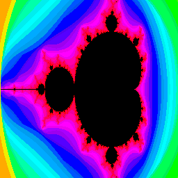

# mandelgif
Generate animated gifs of zoom into the [Mandelbrot Set](https://en.wikipedia.org/wiki/Mandelbrot_set), like this one: 

[]

Usage:
```
$ ./mandelgif -h
  -frames int
        number of frames in final animation (default 50)
  -iter int
        max iterations to apply on 𝒛 (default 1024)
  -point value
        point to zoom in (default (0.272195+0.00540474i))
  -side int
        image width (square so width=height) (default 256)
  -zoom float
        scale to apply at each frame (zoom) (default 0.93)
```