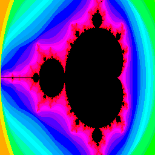

# mandelgif
Generate animated gifs of zoom into the [Mandelbrot Set](https://en.wikipedia.org/wiki/Mandelbrot_set), like this one: 




## Installation

To clone the source code:
```
git clone git@github.com:arl/mandelgif.git
```

To import the module as a dependency to your project (library):
```
go get github.com/arl/mandelgif@latest
```

To build and install the `mandelgif` executable on your system:
```
go install github.com/arl/mandelgif/cmd/mandelgif@latest
```


## Usage:
```
$ ./mandelgif --help
mandelgif: renders a zoom of the Mandelbrot set into an animated Gif.

Usage:
        ./mandelgif [options] [OUTFILE]

Options:
        -help                prints this help message  
        -f -frames           number of frames to render in the animation (default 50)
        -i -iter             max iterations to apply on 𝒛 (default 1024)
        -p -point            zoom point (default point A '0.272195+0.00540474i')
        -z -zoom             zoom factor applied between successive frames (default 0.93)
        -w -width            gif image width (default 256)
        -h -height           gif image height (default 256)

The -p --point option complex numbers in the form x+yi or a letter from A to B which
represent predefined interesting zooming points. Examples: 0, 1, 1i, -1.629-0.0203968i, etc.

OUTFILE defaults to out.gif
```


## Disclaimer

This program is voluntarily **not** optimized. Making it go faster is let as an exercice to the reader!


## [MIT license](./LICENSE)